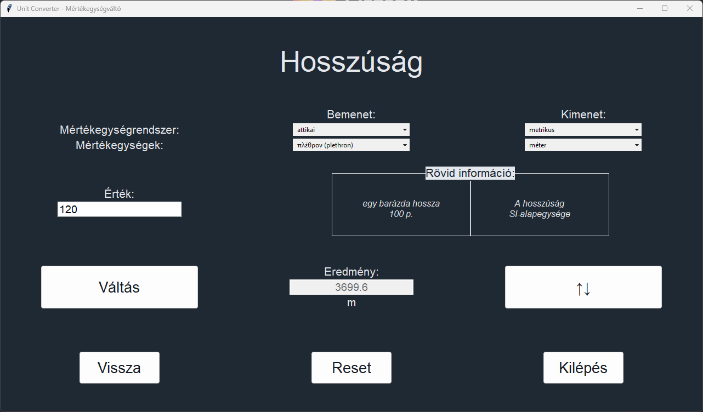

# Mértékegységváltó a történeti tudományok számára

Ez a Python alkalmazás egy egyszerű átváltó történelmi mértékegységek számára. Az alkalmazás felülette (jelenleg csak)
magyar nyelvű, és főképp Ausztriához és Magyarországhoz kapcsolódó mértékegységrendszereket tartalmaz, csakúgy, mint az
ókori görög és római mértékeket. Ugyanakkor bármely mértékegységrendszer bevezethető. Minden modern metrikus és
angolszász mértékegység szerepel viszonyítás végett. A mértékegységváltó a Tkinter GUI eszközkészletet használja ttk
ablakelemekkel.

Minden információ megbízható szakirodalmi forrásból származik, és eredetük a forráskódban jelölve van. A felhasznált
irodalom listája megtalálható a "docs/Sources.md" fájlban.

**NB. Ez az első programozási projektem bármilyen nyelven.**

Az alkalmazás rövidesen át lesz alakítva egy weboldallá, a jobb hozzáférhetőség érdekében.

***

# Unit Converter for Historical Studies

This Python app is a simple converter for historical measurement units. At the moment it has a Hungarian UI,
and features historical unit systems, mainly associated with Austria and Hungary, as well as the Ancient Greek
and Roman measurements. However, any unit system can be implemented. All modern metric and Anglo-American units are
added for reference. The converter uses the Tkinter GUI toolkit with ttk widgets.

All information is based on reliable academic literature, and their origin is indicated in the source code. The list of
consulted sources can be found in the "docs\Sources.md" file.

**NB. This is my first ever coding project in any language.**

The app will soon be converted to a website, for better accessibility.

***

## Képernyőképek - Screenshots

***

## Instructions - Utasítások

A forráskód közvetlenül futtatható Python 3 segítségével, a "main.pyw" indításával.

The source code can be run directly with Python 3, by launching "main.pyw".

***

## Egyéb információk - Other Information

Verziók/Versions: Python 3.11, Tcl/Tk 8.6  
Tesztelve/Tested on: Windows 10, 11, Lubuntu 22.04 LTS

**[Elérhetőség/Contact](mailto:lcs_it@gmail.com)**
