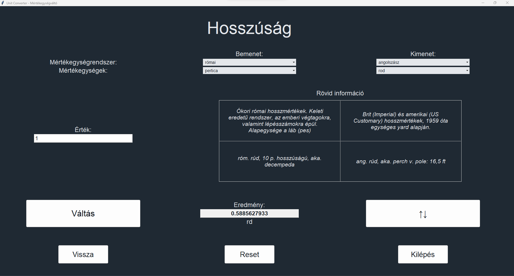

# Mértékegységváltó a történeti tudományok számára

E Python alkalmazás egy egyszerű átváltó történelmi mértékegységek számára. Az alkalmazás felülette jelenleg csak
magyar nyelven elérhető, és főképp Ausztriához és Magyarországhoz kapcsolódó mértékegység-rendszereket tartalmaz,
csakúgy, mint az ókori görög és római mértékeket. Ugyanakkor bármely mértékegységrendszer bevezethető.
Minden modern metrikus és angolszász mértékegység szerepel viszonyítás végett. A mértékegységváltó a Tkinter GUI
eszközkészletet használja ttk ablakelemekkel, a mértékegység-adatbázis az SQLite adatbázismotorral készült.

Minden információ megbízható szakirodalmi forrásból származik, és eredetük az adatbázisban jelölve van. A felhasznált
irodalom listája megtalálható magában az adatbázis fájlban (src/units/unit_database.db), illetve a "docs/Sources.md"
dokumentumban. Az adatbázis tartalma elérhető .csv formátumban is a "docs/csv" könyvtárban.

Az új mértékegység-rendszerek hozzáadása folyamatos.

**NB. Ez az első programozási projektem bármilyen nyelven.**

Az alkalmazás rövidesen át lesz alakítva egy weboldallá, a jobb hozzáférhetőség érdekében.

***

# Unit Converter for Historical Studies

This Python app is a simple converter for historical measurement units. For the moment, the app it is only available
with a Hungarian UI, and features historical unit systems mainly associated with Austria and Hungary, as well as the
Ancient Greek and Roman measurements. However, any unit system can be implemented. All modern metric and Anglo-American
units are added for reference. The converter uses the Tkinter GUI toolkit with ttk widgets, the unit database was
built with the SQLite database engine.

All information is based on reliable academic literature, and their origin is indicated in the database. The list of
consulted sources can be found in the database file itself (src/units/unit_database.db), as well as in the
"docs/Sources.md" document. The contents of the database is also accessible in .csv format in the "docs/csv" folder.

New unit systems are continuously added.

**NB. This is my first ever coding project in any language.**

The app will soon be converted to a website, for better accessibility.

***

## Képernyőképek - Screenshots

***

## Utasítások - Instructions

A forráskód közvetlenül futtatható Python 3(.12) segítségével, a "main.pyw" indításával. Emellett egy kompilált Windows
.exe és Linux binary release is elérhető.

The source code can be run directly with Python 3(.12) by launching "main.pyw". In addition to this, a compiled Windows
.exe and Linux binary release is also available.

***

## Egyéb információk - Other Information

Verziók/Versions: Python 3.12, Tcl/Tk 8.6, SQLite 3.35.5  
Tesztelve/Tested on: Windows 10, 11, Ubuntu 23.10, Lubuntu 22.04 LTS

**[Elérhetőség/Contact](mailto:lcs_it@proton.me)**

